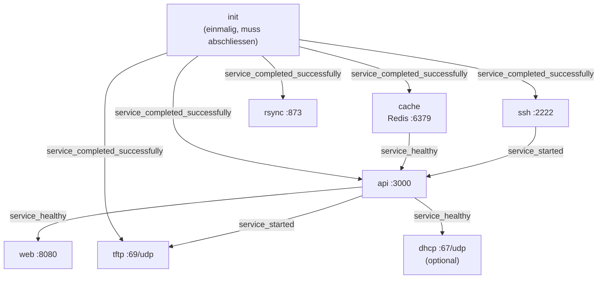
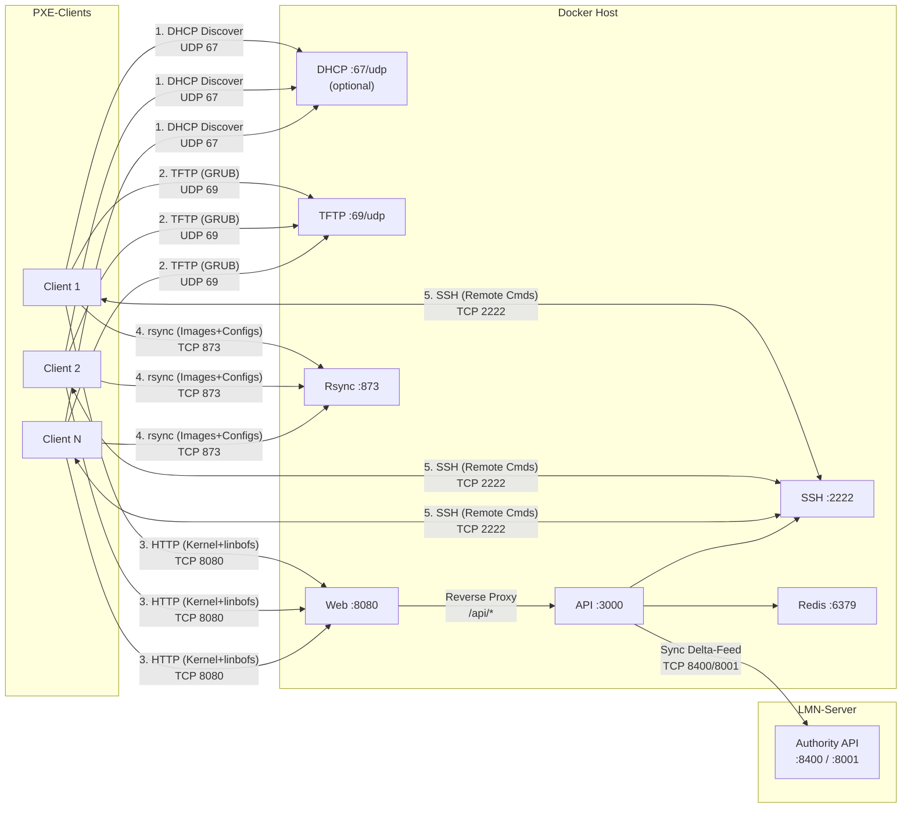

# LINBO Docker — Admin-Handbuch

> **Stand:** 2026-03-10 | **Zielgruppe:** Systemadministratoren | **Sprache:** Deutsch mit englischen Fachbegriffen

---

## Inhaltsverzeichnis

1. [Ueberblick](#1-ueberblick)
2. [Container-Architektur](#2-container-architektur)
3. [Volumes](#3-volumes)
4. [Netzwerk-Diagramm](#4-netzwerk-diagramm)
5. [DHCP-Konfiguration](#5-dhcp-konfiguration)
6. [Design-Entscheidungen](#6-design-entscheidungen)
7. [Betrieb und Wartung](#7-betrieb-und-wartung)
8. [Weiterfuehrende Dokumentation](#8-weiterfuehrende-dokumentation)

---

## 1. Ueberblick

### Was ist LINBO Docker?

LINBO Docker ist eine containerisierte Version von [LINBO](https://linuxmuster.net) (**Li**nux **N**etwork **Bo**ot) — dem Netzwerk-Boot- und Imaging-System von linuxmuster.net. Es ermoeglicht PXE Network Boot, Image-Synchronisation und Fernsteuerung von Clients ueber das Netzwerk.

### Warum Docker?

Eine traditionelle linuxmuster.net-Installation benoetigt eine spezifische Ubuntu-Version, Samba AD, Sophomorix und zahlreiche Systemabhaengigkeiten. LINBO Docker braucht nur Docker:

- **Isolation** — keine Systemabhaengigkeiten, keine Konflikte mit bestehender Software
- **Reproduzierbarkeit** — identische Builds auf jedem System, versioniert via Git
- **Portabilitaet** — laeuft auf jedem Linux mit Docker (Ubuntu, Debian, RHEL, etc.)
- **Kein Eingriff ins Host-System** — alle Dienste in Containern, Daten in Docker Volumes

### Read-Only-Prinzip

**Docker schreibt NIEMALS Hosts, Configs oder Rooms zurueck zum LMN-Server.** Alle CRUD-Operationen (Hosts anlegen, Konfigurationen aendern, Raeume verwalten) geschehen ausschliesslich auf dem LMN-Server — ueber webui7 oder `linuxmuster-import-devices`. LINBO Docker konsumiert diese Daten ausschliesslich lesend ueber einen Cursor-basierten Delta-Feed der Authority API.

Dieses Prinzip stellt sicher, dass der LMN-Server immer die einzige Source of Truth bleibt. Es gibt keinen Split-Brain, keine Synchronisationskonflikte und kein Risiko, dass Docker-seitige Aenderungen LMN-Daten korrumpieren.

### Weitere Dokumentation

- [INSTALL.md](INSTALL.md) — Schritt-fuer-Schritt-Installationsanleitung
- [UNTERSCHIEDE-ZU-LINBO.md](UNTERSCHIEDE-ZU-LINBO.md) — Vergleich Docker vs. Vanilla-LINBO

---

## 2. Container-Architektur

LINBO Docker besteht aus 8 Containern. Jeder hat eine klar definierte Rolle:

| Container | Port | Netzwerk-Modus | Rolle | Resource Limits |
|-----------|------|----------------|-------|-----------------|
| **init** | — | bridge | Boot-Dateien herunterladen und extrahieren (einmalig) | 2.0 CPU, 512M |
| **tftp** | 69/udp | host | PXE-Boot via TFTP (GRUB-Dateien) | 0.5 CPU, 64M |
| **rsync** | 873/tcp | bridge (Port Mapping) | Image- und Config-Synchronisation | 2.0 CPU, 256M |
| **ssh** | 2222/tcp | bridge (Port Mapping) | SSH-Server fuer Remote-Befehle an LINBO-Clients | 0.5 CPU, 128M |
| **cache** | 6379/tcp | bridge (Port Mapping) | Redis — Cache, Host-Status, Operations, Settings | 1.0 CPU, 256M |
| **api** | 3000/tcp | bridge (Port Mapping) | REST API + WebSocket (Express.js) | 2.0 CPU, 512M |
| **web** | 8080->80/tcp | bridge (Port Mapping) | React SPA + HTTP Boot (Nginx) | 1.0 CPU, 128M |
| **dhcp** | 67/udp | host | dnsmasq Proxy-DHCP (optional, `--profile dhcp`) | 0.5 CPU, 64M |

> **Hinweis:** Die Ports 3000 (API), 6379 (Redis) und 8080 (Web) sind ueber Umgebungsvariablen konfigurierbar (`API_PORT`, `REDIS_EXTERNAL_PORT`, `WEB_PORT`).

### Startup-Reihenfolge

Die Container starten in einer definierten Reihenfolge. Der `init`-Container muss zuerst erfolgreich durchlaufen, bevor die meisten anderen Container starten koennen:



**Abhaengigkeits-Bedingungen im Detail:**

| Container | Wartet auf | Bedingung | Bedeutung |
|-----------|-----------|-----------|-----------|
| rsync | init | `service_completed_successfully` | Init muss Boot-Dateien fertig heruntergeladen haben |
| ssh | init | `service_completed_successfully` | Init muss abgeschlossen sein |
| cache | — | — | Startet sofort (kein `depends_on` auf init) |
| api | init | `service_completed_successfully` | Boot-Dateien muessen vorhanden sein |
| api | cache | `service_healthy` | Redis muss auf `PING` mit `PONG` antworten |
| api | ssh | `service_started` | SSH-Container muss gestartet sein (nicht notwendigerweise healthy) |
| web | api | `service_healthy` | API muss auf `/health` mit HTTP 200 antworten |
| tftp | init | `service_completed_successfully` | Boot-Dateien muessen vorhanden sein |
| tftp | api | `service_started` | API muss gestartet sein (baut linbofs64) |
| dhcp | api | `service_healthy` | API muss healthy sein (DHCP holt Config von API) |

> **Hinweis:** Der `cache`-Container (Redis) hat in `docker-compose.yml` kein `depends_on` auf `init`. Er startet unabhaengig und ist oft als erster bereit. Die `api` wartet auf `cache: service_healthy`, was sicherstellt, dass Redis erreichbar ist, bevor die API startet.

### Health Checks

Jeder Container meldet seinen Zustand ueber einen Health Check:

| Container | Check-Kommando | Interval | Start Period | Retries |
|-----------|---------------|----------|-------------|---------|
| cache | `redis-cli ping` | 10s | — | 5 |
| api | `curl -sf http://localhost:3000/health` | 10s | 60s | 10 |
| web | `curl -sf http://localhost/health` | 10s | 30s | 5 |
| tftp | `pgrep in.tftpd` | 30s | — | 3 |
| rsync | `pgrep rsync` | 30s | — | 3 |
| ssh | `pgrep sshd` | 30s | — | 3 |

Der `init`-Container hat keinen Health Check — er laeuft einmalig und beendet sich mit Exit Code 0 bei Erfolg.

---

## 3. Volumes

LINBO Docker verwendet 6 benannte Docker Volumes fuer persistente Daten:

| Volume | Pfad im Container | Inhalt | Backup-relevant? |
|--------|-------------------|--------|------------------|
| `linbo_srv_data` | `/srv/linbo` | Boot-Dateien, Images, GRUB-Configs, linbocmd | **JA** (Images!) |
| `linbo_config` | `/etc/linuxmuster/linbo` | SSH-Keys, start.conf Templates | **JA** (Keys!) |
| `linbo_log` | `/var/log/linuxmuster/linbo` | API Logs | Nein |
| `linbo_redis_data` | `/data` (cache) | Redis Persistenz | Nein (Cache) |
| `linbo_kernel_data` | `/var/lib/linuxmuster/linbo` | Kernel-Varianten (.deb Pakete) | Nein (re-downloadbar) |
| `linbo_driver_data` | `/var/lib/linbo/drivers` | Patchclass Treiber-Sets | **JA** (wenn Patchclass genutzt) |

**Zusaetzliche Bind-Mounts** (direkt aus dem Git-Repository, keine Docker Volumes):

| Host-Pfad | Container-Pfad | Container | Zweck |
|-----------|---------------|-----------|-------|
| `./themes` | `/opt/linbo-themes:ro` | init | GRUB-Theme-Dateien |
| `./scripts/server` | `/usr/share/linuxmuster/linbo` | ssh, api | Server-seitige Scripts |
| `./config/rsyncd.conf` | `/etc/rsyncd.conf:ro` | rsync | rsync-Konfiguration |
| `./config/rsyncd.secrets` | `/etc/rsyncd.secrets:ro` | rsync, api | rsync-Authentifizierung |

> **Backup-Empfehlung:** Die Volumes `linbo_srv_data` (insbesondere `/srv/linbo/images/`) und `linbo_config` (SSH-Keys) sollten regelmaessig gesichert werden. Alle anderen Volumes koennen aus dem Git-Repository oder durch erneuten Download rekonstruiert werden.

---

## 4. Netzwerk-Diagramm

Das folgende Diagramm zeigt alle Netzwerkverbindungen in einem typischen Deployment mit LMN-Server, Docker Host und PXE-Clients:



### Boot-Ablauf eines PXE-Clients

1. **DHCP** — Client erhaelt IP-Adresse und PXE-Boot-Optionen (`next-server`, `filename`)
2. **TFTP** — Client laedt GRUB-Bootloader (`core.0` fuer BIOS, `core.efi` fuer UEFI)
3. **HTTP** — GRUB laedt Kernel (`linbo64`, 15 MB) und Initramfs (`linbofs64`, ~55 MB) per HTTP (Port 8080) — 5-10x schneller als TFTP
4. **rsync** — LINBO-Client synchronisiert Images und Konfigurationen vom Server (Port 873)
5. **SSH** — API sendet Remote-Befehle an LINBO-Clients (Port 2222, bidirektional)

### Firewall-Regeln

Die folgenden Ports muessen auf dem Docker Host freigeschaltet sein.

**Eingehend (von PXE-Clients zum Docker Host):**

| Port | Protokoll | Richtung | Dienst | Anmerkung |
|------|-----------|----------|--------|-----------|
| 69 | UDP | Client -> Docker | TFTP | PXE-Boot (GRUB-Dateien). Host-Network-Modus — Firewall-Regel gilt direkt fuer den Host, nicht durch Docker NAT. |
| 873 | TCP | Client -> Docker | rsync | Image- und Config-Synchronisation. Bridge-Netzwerk mit Port Mapping. |
| 2222 | TCP | Bidirektional | SSH | Dropbear SSH auf LINBO-Clients. Die API sendet Remote-Befehle (sync, start, reboot) an Clients ueber diesen Port. Bridge-Netzwerk mit Port Mapping. |
| 8080 | TCP | Browser/Client -> Docker | Web UI + HTTP Boot | Nginx: React SPA fuer Browser, HTTP Boot fuer GRUB (Kernel + linbofs64). Konfigurierbar via `WEB_PORT`. |
| 3000 | TCP | Intern | API | REST API + WebSocket. Normalerweise nur vom Web-Container (Reverse Proxy), nicht direkt von Clients. Konfigurierbar via `API_PORT`. |
| 6379 | TCP | Intern | Redis | Nur extern noetig bei verteilten Deployments. Konfigurierbar via `REDIS_EXTERNAL_PORT`. |
| 67 | UDP | Client -> Docker | DHCP | Nur aktiv mit `--profile dhcp`. Host-Network-Modus. Nur verwenden, wenn kein eigener DHCP-Server PXE-Optionen liefert. |

**Ausgehend (vom Docker Host):**

| Port | Protokoll | Richtung | Dienst | Anmerkung |
|------|-----------|----------|--------|-----------|
| 443 | TCP | Docker -> Internet | HTTPS | `deb.linuxmuster.net` (Init-Container laedt linbo7-Pakete), GitHub (npm Packages fuer Web-Container Build). Nur beim Build/Update noetig. |
| 8001 | TCP | Docker -> LMN | linuxmuster-api | Sync-Modus: `LMN_API_URL` zeigt auf diesen Port. Standard-Endpunkt. |
| 8400 | TCP | Docker -> LMN | Authority API | Alternativer Sync-Endpunkt (eigenentwickelte API). Je nach Konfiguration `LMN_API_URL`. |

> **Wichtig — SSH-Richtung:** Port 2222 wird bidirektional genutzt. Die API initiiert SSH-Verbindungen **zu** den LINBO-Clients (Remote-Befehle), und die Clients verbinden sich fuer rsync-Operationen zurueck. Der SSH-Container im Docker Host ist **kein** Ziel fuer Client-SSH — er dient als Relay.

> **Wichtig — Host Network vs. Bridge:** TFTP (69/udp) und DHCP (67/udp) verwenden `network_mode: host`. Ihre Ports erscheinen nicht in `docker port` und brauchen Host-seitige Firewall-Regeln. Alle anderen Container verwenden Bridge-Netzwerk mit Port Mapping — Docker oeffnet die Ports automatisch (iptables-Regeln).

### Minimale Firewall-Konfiguration

Fuer den einfachsten Betrieb (ohne DHCP-Container, ohne Sync) genuegen diese eingehenden Regeln:

```bash
# Minimal: TFTP + HTTP Boot + rsync + SSH
ufw allow 69/udp    comment "LINBO TFTP"
ufw allow 873/tcp   comment "LINBO rsync"
ufw allow 2222/tcp  comment "LINBO SSH"
ufw allow 8080/tcp  comment "LINBO Web + HTTP Boot"
```

---

## 5. DHCP-Konfiguration

PXE-Boot erfordert, dass der DHCP-Server dem Client mitteilt, von welchem Server und mit welcher Datei er booten soll. Es gibt zwei Optionen:

### Option A: Bestehenden DHCP-Server konfigurieren

Wenn bereits ein DHCP-Server (ISC DHCP, dnsmasq, Windows DHCP) im Netzwerk laeuft, muessen dort PXE-Optionen hinzugefuegt werden.

**Vorteil:** Volle Kontrolle, kein zusaetzlicher Container.
**Nachteil:** Erfordert Zugriff auf die DHCP-Server-Konfiguration.

#### ISC DHCP (dhcpd.conf)

```
option architecture-type code 93 = unsigned integer 16;

if option architecture-type = 00:07 {
    filename "boot/grub/x86_64-efi/core.efi";
} elsif option architecture-type = 00:09 {
    filename "boot/grub/x86_64-efi/core.efi";
} else {
    filename "boot/grub/i386-pc/core.0";
}

next-server <LINBO_SERVER_IP>;
```

Ersetze `<LINBO_SERVER_IP>` durch die IP-Adresse des Docker Hosts (z.B. `10.0.0.13`).

#### dnsmasq

```
dhcp-match=set:bios,option:client-arch,0
dhcp-match=set:efi64,option:client-arch,7
dhcp-match=set:efi64,option:client-arch,9
dhcp-boot=tag:bios,boot/grub/i386-pc/core.0,<LINBO_SERVER_IP>
dhcp-boot=tag:efi64,boot/grub/x86_64-efi/core.efi,<LINBO_SERVER_IP>
```

### Option B: Eingebauter Proxy-DHCP-Container

Der eingebaute DHCP-Container laeuft als **Proxy-DHCP** — er verteilt keine IP-Adressen, sondern ergaenzt die bestehenden DHCP-Antworten um PXE-Boot-Optionen.

**Vorteil:** Kein bestehender DHCP-Server muss geaendert werden. Funktioniert parallel zum vorhandenen DHCP.
**Nachteil:** Zusaetzlicher Container, nutzt Host-Network-Modus.

#### Starten

```bash
docker compose --profile dhcp up -d
```

#### Konfiguration

Die Konfiguration erfolgt ueber Umgebungsvariablen in `.env`:

| Variable | Standard | Beschreibung |
|----------|---------|-------------|
| `DHCP_INTERFACE` | `eth0` | Netzwerk-Interface fuer DHCP-Antworten |
| `LINBO_SERVER_IP` | `10.0.0.1` | IP-Adresse des Docker Hosts (wird als `next-server` gesendet) |

#### Technische Details

- Nutzt `network_mode: host` — der Container hat direkten Zugriff auf alle Host-Interfaces
- Benoetigt `NET_ADMIN` und `NET_RAW` Capabilities (fuer Raw-Socket-Zugriff auf DHCP)
- Generiert die dnsmasq-Konfiguration automatisch basierend auf den Umgebungsvariablen
- Holt die Proxy-DHCP-Konfiguration von der API (`/api/v1/dhcp/export/dnsmasq-proxy`)
- Falls die API nicht erreichbar ist, wird eine minimale Fallback-Konfiguration verwendet
- Unterstuetzt Live-Config-Reloads via inotify-Watcher

### Boot-Dateien: BIOS vs. UEFI

| Client-Architektur | Boot-Datei | Protokoll |
|-------------------|-----------|-----------|
| BIOS (Legacy) | `boot/grub/i386-pc/core.0` | TFTP |
| UEFI 64-Bit | `boot/grub/x86_64-efi/core.efi` | TFTP |

Nach dem initialen GRUB-Download per TFTP (~10 KB) werden Kernel und Initramfs per HTTP geladen (Port 8080) — das ist 5-10x schneller als reines TFTP.

---

## 6. Design-Entscheidungen

Dieses Kapitel erklaert die grundlegenden Design-Entscheidungen und warum sie getroffen wurden. Es hilft Administratoren, das System zu verstehen und informierte Anpassungsentscheidungen zu treffen.

### Warum Read-Only?

**Prinzip:** Docker darf LMN-Daten niemals veraendern.

In einem linuxmuster.net-Setup ist der LMN-Server die einzige Quelle fuer Host-, Konfigurations- und Raumdaten. Diese Daten werden ueber `devices.csv` und `start.conf.*` Dateien verwaltet, die von webui7 und `linuxmuster-import-devices` geschrieben werden.

Wenn LINBO Docker diese Daten ebenfalls schreiben wuerde, entsteht ein **Split-Brain-Problem:** Zwei Systeme aendern dieselben Daten unabhaengig voneinander. Konflikte waeren unvermeidlich — insbesondere bei Netzwerkunterbrechungen zwischen Docker und LMN.

Stattdessen konsumiert LINBO Docker die Daten ausschliesslich ueber einen **Cursor-basierten Delta-Feed** der Authority API. Bei jeder Synchronisation fragt Docker nur nach Aenderungen seit dem letzten bekannten Stand. Dies garantiert:

- **Konsistenz:** Der LMN-Server bleibt immer Source of Truth
- **Kein Datenverlust:** Kein Risiko, dass Docker LMN-Daten ueberschreibt
- **Einfache Fehlersuche:** Datenprobleme muessen nur an einer Stelle gesucht werden

### Warum Hooks statt Patches?

**Prinzip:** Das linbofs64-Archiv wird niemals direkt modifiziert.

Das `update-linbofs.sh` Build-Script injiziert nur essentielle Dateien (SSH-Keys, Kernel-Module, Firmware) in das linbofs64-Initramfs. Fuer alle weiteren Anpassungen gibt es ein **Hook-System**:

```
/etc/linuxmuster/linbo/hooks/
  update-linbofs.pre.d/    # VOR dem CPIO-Repack (Dateien im linbofs aendern)
  update-linbofs.post.d/   # NACH dem Repack (Benachrichtigungen, Checksummen)
```

**Pre-Hooks** laufen im extrahierten linbofs-Root und koennen Dateien hinzufuegen, aendern oder loeschen. **Post-Hooks** laufen nach dem Repack und koennen auf das fertige Archiv reagieren.

Warum dieses Design statt direkter Patches:

- **Upstream-kompatibel:** Wenn linuxmuster-linbo7 aktualisiert wird, gibt es keine Merge-Konflikte
- **Modular:** Jede Anpassung ist ein eigenstaendiges Script mit Nummernpraefix (z.B. `01_edulution-plymouth`)
- **Reversibel:** Ein Hook kann durch Loeschen der Datei sofort deaktiviert werden
- **Robust:** Hook-Fehler erzeugen eine Warnung, brechen aber den Build nicht ab

Beispiel: Der `01_edulution-plymouth` Hook injiziert ein Custom-Splash-Theme in das linbofs64.

Siehe [docs/hooks.md](hooks.md) fuer die vollstaendige Hook-Dokumentation.

### Warum Docker?

**Prinzip:** Maximale Isolation bei minimalen Voraussetzungen.

Eine traditionelle linuxmuster.net-Installation erfordert:
- Ubuntu Server (spezifische Version)
- Samba AD (Active Directory)
- Sophomorix (Benutzerverwaltung)
- webui7 (Weboberflaeche)
- Zahlreiche Systemabhaengigkeiten (PHP, Python, Perl, etc.)

LINBO Docker braucht nur:
- Einen Linux-Host mit Docker und Docker Compose
- Netzwerkzugang zum PXE-Subnetz

Vorteile:

- **Keine Systemabhaengigkeiten:** Alle Dienste sind in Containern isoliert. Keine Konflikte mit bestehender Software.
- **Identische Builds:** `docker compose up` erzeugt immer dasselbe Ergebnis, unabhaengig vom Host-Betriebssystem.
- **Einfaches Rollback:** `docker compose down && git checkout v1.0 && docker compose up` — fertig.
- **Parallelisierbar:** Mehrere LINBO-Docker-Instanzen koennen auf verschiedenen Hosts laufen (z.B. pro Standort).

### Warum Package-Kernel?

**Prinzip:** LINBO Docker nutzt den Kernel aus dem linbo7-Paket, nicht den Host-Kernel.

Das `linuxmuster-linbo7`-Paket enthaelt einen eigenen Linux-Kernel von kernel.org (stable, longterm oder legacy). Der Init-Container laedt dieses Paket herunter und extrahiert Kernel und Kernel-Module.

Warum nicht den Host-Kernel verwenden:

- **Reproduzierbarkeit:** Derselbe Kernel auf allen Deployments, unabhaengig vom Host-OS
- **Keine Host-Abhaengigkeit:** Keine `/boot` oder `/lib/modules` Bind-Mounts noetig
- **Kernel-Wechsel via API:** `POST /api/v1/system/kernel-switch` erlaubt den Wechsel zwischen `stable`, `longterm` und `legacy` Varianten ohne Neustart des Hosts
- **Verifiziert:** Vanilla LINBO bootet korrekt mit dem Package-Kernel auf realer Hardware (Intel Core Ultra 5, NVMe, Intel NIC)

---

## 7. Betrieb und Wartung

### Makefile-Targets

Das Makefile bietet administrative Kurzbefehle:

| Kommando | Beschreibung |
|----------|-------------|
| `make up` | Alle Container starten (`docker compose up -d`) |
| `make down` | Alle Container stoppen (`docker compose down`) |
| `make rebuild` | API + Web neu bauen (`docker compose up -d --build api web`) |
| `make rebuild-all` | Alle Container neu bauen (`docker compose up -d --build`) |
| `make logs` | API-Logs anzeigen (`docker logs linbo-api --tail 50 -f`) |
| `make logs-all` | Alle Logs anzeigen (`docker compose logs --tail 20 -f`) |
| `make health` | Health-Check (API + Web Endpunkte pruefen) |
| `make wait-ready` | Blockiert bis alle Container healthy sind (`scripts/wait-ready.sh`) |
| `make doctor` | 24 Diagnose-Checks in 6 Kategorien ausfuehren (`scripts/doctor.sh`) |
| `make test` | API-Test-Suite ausfuehren (`docker exec linbo-api npm test`) |
| `make status` | Git- und Docker-Status anzeigen |
| `make clean` | Docker Builder- und Image-Cache leeren |

### Log-Zugriff

```bash
# API-Container Logs (Echtzeit)
docker logs linbo-api --tail 50 -f

# Alle Container Logs
docker compose logs --tail 20 -f

# Nur einen bestimmten Container
docker compose logs rsync --tail 50 -f
```

Persistente Logs liegen im Volume `linbo_log` (Pfad im Container: `/var/log/linuxmuster/linbo`).

### Diagnose mit `make doctor`

Das Script `scripts/doctor.sh` fuehrt 24 Checks in 6 Kategorien durch:

1. **Container Health** — Alle Container (cache, api, web, tftp, rsync, ssh) gesund? Init Exit Code 0?
2. **Volume Permissions** — `/srv/linbo` beschreibbar durch API-Container (UID 1001)?
3. **SSH Keys** — Alle 4 SSH-Schluesselpaare vorhanden (`ssh_host_rsa_key`, `.pub`, `linbo_client_key`, `.pub`)?
4. **linbofs64 Build Status** — `.linbofs-patch-status` Marker und `linbofs64` vorhanden?
5. **Redis Connectivity** — `redis-cli PING` → `PONG`?
6. **PXE Port Reachability** — Ports 69/udp, 873/tcp, 3000/tcp, 2222/tcp erreichbar?

```bash
# Diagnose ausfuehren
make doctor

# Oder direkt
./scripts/doctor.sh
```

### Update-Prozedur

```bash
cd linbo-docker
git pull
docker compose up -d --build
make wait-ready
make doctor
```

1. `git pull` — neueste Version holen
2. `docker compose up -d --build` — Container mit aktualisierten Images neu bauen und starten
3. `make wait-ready` — warten bis alle Container healthy sind
4. `make doctor` — verifizieren, dass alles korrekt laeuft

### Anpassungen via Hooks

Fuer Anpassungen am linbofs64-Initramfs (z.B. Custom Branding, zusaetzliche Konfigurationsdateien) wird das Hook-System verwendet:

**Hook-Verzeichnisse:**
```
/etc/linuxmuster/linbo/hooks/
  update-linbofs.pre.d/   # VOR dem CPIO-Repack
  update-linbofs.post.d/  # NACH dem Repack
```

**Beispiel:** Der `01_edulution-plymouth` Hook ersetzt das Standard-Plymouth-Splash-Theme mit einem Custom-Branding:

```bash
#!/bin/bash
# /etc/linuxmuster/linbo/hooks/update-linbofs.pre.d/01_edulution-plymouth
THEME_SRC="/root/linbo-docker/plymouth/linbo-splash"
THEME_DST="usr/share/plymouth/themes/linbo-splash"
[ -d "$THEME_SRC" ] || exit 0
[ -d "$THEME_DST" ] || exit 0
echo "  - Injecting custom Plymouth theme..."
cp "$THEME_SRC/linbo-splash.script" "$THEME_DST/linbo-splash.script"
cp "$THEME_SRC/logo_no_arrows.png" "$THEME_DST/logo_no_arrows.png"
```

Pre-Hooks laufen im extrahierten linbofs-Root. Relative Pfade wie `usr/share/...` funktionieren direkt.

Siehe [docs/hooks.md](hooks.md) fuer die vollstaendige Hook-Dokumentation mit allen exportierten Variablen.

---

## 8. Weiterfuehrende Dokumentation

| Dokument | Beschreibung |
|----------|-------------|
| [INSTALL.md](INSTALL.md) | Schritt-fuer-Schritt-Installationsanleitung (von Prerequisites bis PXE-Boot) |
| [TROUBLESHOOTING.md](TROUBLESHOOTING.md) | Ausfuehrliche Fehlerdiagnose (25 bekannte Probleme mit Loesungen) |
| [hooks.md](hooks.md) | Hook-System fuer linbofs64-Anpassungen (Pre- und Post-Hooks) |
| [UNTERSCHIEDE-ZU-LINBO.md](UNTERSCHIEDE-ZU-LINBO.md) | Vergleich Docker vs. Vanilla-LINBO (Features, Infrastruktur, Kompatibilitaet) |
| [ARCHITECTURE.md](ARCHITECTURE.md) | Entwickler-Referenz (Mermaid-Diagramme, API-Struktur, Redis-Keys) |

---

*Letzte Aktualisierung: 2026-03-10*
*LINBO Docker — Admin-Handbuch*
