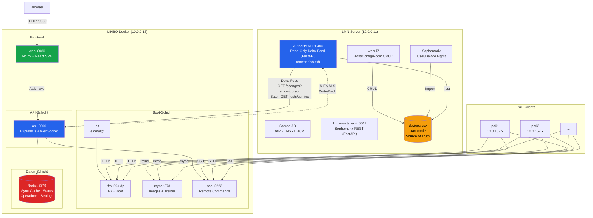
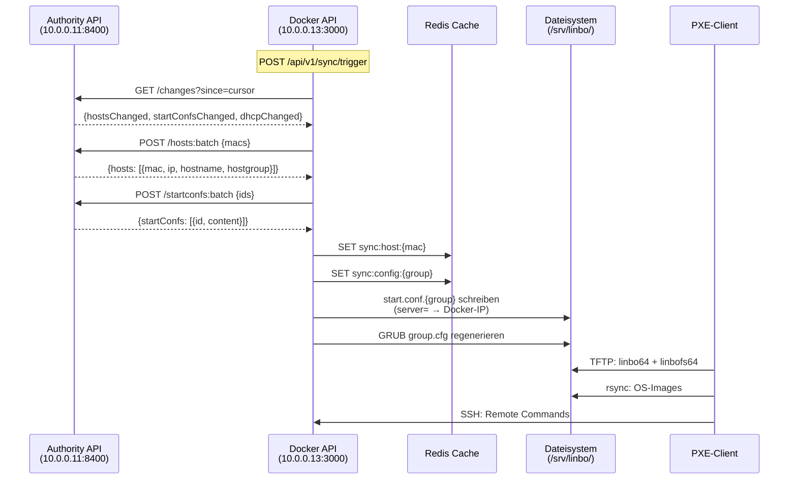
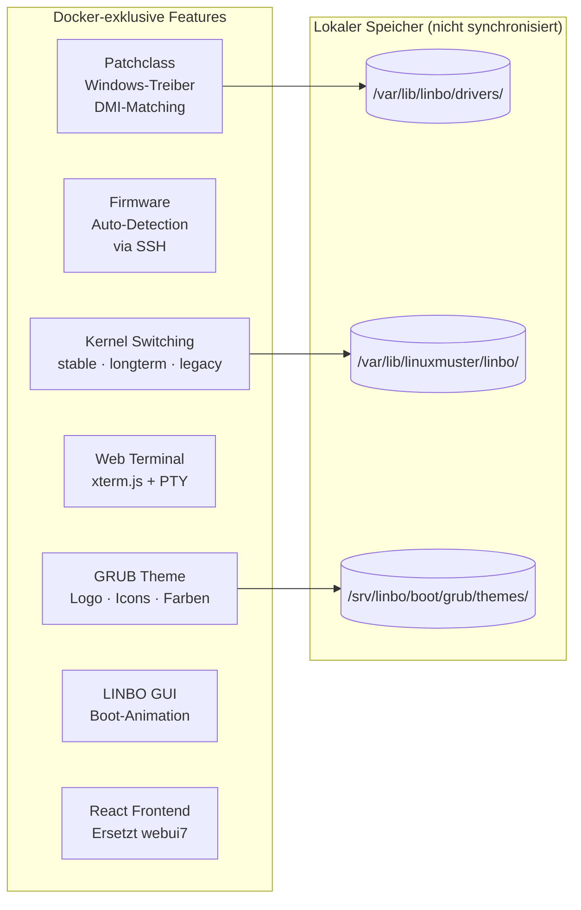
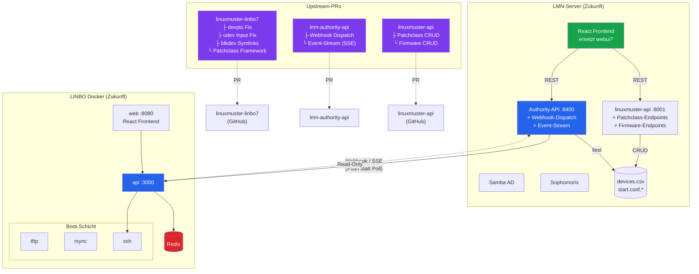

# LINBO Docker — Architecture

> **Stand:** 2026-03-04 | **Modus:** Sync (Read-Only)

## IST-Zustand (aktuell)

## Datenfluss im Sync-Modus

## Docker-exklusive Features

Diese Features existieren nur in LINBO Docker, nicht in der Standard-Installation:

## SOLL-Zustand (mit Upstream-PRs)

Ziel: Docker-exklusive Features universal machen via PRs an die Upstream-Repos.

## Upstream-PR Übersicht

| Repo | Feature | Typ | Beschreibung |
|------|---------|-----|-------------|
| `linuxmuster-linbo7` | devpts Mount | Bugfix | `/dev/pts` vor dropbear mounten |
| `linuxmuster-linbo7` | udev Input | Bugfix | udevd restart vor linbo_gui |
| `linuxmuster-linbo7` | blkdev Symlinks | Bugfix | `/dev/sd*` Symlinks für NVMe |
| `linuxmuster-linbo7` | Patchclass | Feature | `linbo_patch_registry` Client-Script |
| `lmn-authority-api` | Webhooks | Feature | Push-Notifications bei Änderungen |
| `linuxmuster-api` | Patchclass CRUD | Feature | Treiber-Verwaltung via REST |
| `linuxmuster-api` | Firmware CRUD | Feature | Firmware-Verwaltung via REST |

## Container-Übersicht

| Container | Port | Netzwerk | Rolle |
|-----------|------|----------|-------|
| `init` | — | — | Boot-Dateien herunterladen (einmalig) |
| `tftp` | 69/udp | host | PXE-Boot für Clients |
| `rsync` | 873 | bridge | Images + Treiber verteilen |
| `ssh` | 2222 | host | Remote Commands + Terminal |
| `cache` | 6379 | bridge | Redis (Sync, Status, Settings) |
| `api` | 3000 | bridge | REST API + WebSocket |
| `web` | 8080 | bridge | Nginx + React SPA |
| `dhcp` | 67/udp | host | dnsmasq Proxy (optional) |

## Volume-Mapping

| Volume | Mount | Inhalt |
|--------|-------|--------|
| `linbo_srv_data` | `/srv/linbo` | Boot-Dateien, Images, Configs |
| `linbo_config` | `/etc/linuxmuster/linbo` | SSH-Keys, Kernel-State |
| `linbo_log` | `/var/log/linuxmuster/linbo` | Logs |
| `linbo_redis_data` | Redis Data | Sync-Cursor, Cache |
| `linbo_kernel_data` | `/var/lib/linuxmuster/linbo` | Kernel-Varianten |
| `linbo_driver_data` | `/var/lib/linbo/drivers` | Patchclass-Treiber |
